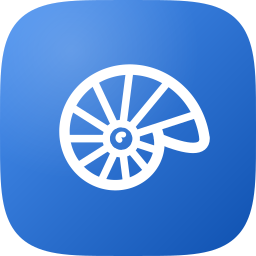

<p align="center">
  
</p>

<h1 align="center">Foscal</h1>

A free, open-source Android calendar app with a modern, Material 3 / Material You
design. Built for people who want a beautiful, fast, privacy-respecting calendar
that works both **fully offline** (local calendars) and **online** with any
CalDAV-compatible server (Nextcloud, ownCloud, Radicale, Baïkal, …) via
[DAVx⁵](https://www.davx5.com).

> Status: **beta**. The core calendar is functional and stable — month/week/agenda
> views, event create/edit/delete, recurring events, reminders, and offline local
> calendars all work. Rough edges remain (see [Roadmap](#roadmap)).

## Design goals

- **Beautiful and modern.** Jetpack Compose + Material 3 with dynamic color.
- **Works offline.** Create and use local calendars without any account or
  network.
- **Open sync.** Uses the Android system Calendar Provider, so any installed
  sync adapter (DAVx⁵ being the recommended one for CalDAV) keeps everything
  in sync automatically.
- **Free & open source** under the GNU General Public License v3.

## Current status

**Working today**

- Three calendar views in the bottom nav: **Month** (centered date numerals with
  per-calendar color dots; whole-month grids that slide between months and fade
  out-of-month days to grey, tap the month/year title to jump to a specific
  month, with an inline day preview under the grid), **Week** (an hourly
  schedule with a weekday strip, long-press drag-to-create, and long-press
  drag-to-move timed events), and **Agenda** (a grouped schedule that loads
  older and newer events as you scroll). Multi-day and spanning all-day events
  render on every day they cover.
- **Custom design system** — the app's own visual voice: the *Bricolage
  Grotesque* display face on dates and titles, *Hanken Grotesque* for UI, a
  Cobalt accent, soft color-stripe event cards, a unified app/onboarding icon,
  and 24-hour time by default. Full light & dark support.
- **Settings** is a fourth bottom-nav tab (it slides in alongside Month / Week /
  Agenda) with appearance, date & time, calendar visibility, and reminder options.
- **Configurable accent** — pick **Cobalt / Violet / Forest** or a custom color
  in Settings; the whole UI re-tints instantly and the choice is persisted.
- **Theme & clock** — force **System / Light / Dark** and toggle **12- / 24-hour
  time**; both apply live across every screen and persist.
- **Event editor** — create, edit, and delete events with title, calendar,
  all-day toggle, start/end date-time pickers, location, notes, and reminder.
- **Recurring events** — daily / weekly / monthly / yearly, with a custom
  editor for interval, end date / occurrence count, and by-weekday
  selection. Editing or deleting a repeating event prompts for **this
  occurrence**, **this and following events**, or **the whole series**;
  single-occurrence changes are stored as proper exceptions and "this and
  following" splits the series at the chosen point. Recurrence rules synced
  from CalDAV (BYDAY/INTERVAL/UNTIL) are preserved on unrelated edits.
- **Reminders / notifications** — exact-alarm reminders via `AlarmManager`,
  re-scheduled on boot and whenever the calendar changes, delivered on a
  dedicated notification channel that deep-links back to the event.
- **Real calendar colors** everywhere, with automatic light/dark contrast text.
- **Search** across events by title, location, or notes; results expand older
  and newer as you scroll, and recurring series collapse to a single occurrence
  so they don't flood results.
- **Home-screen widget** showing your upcoming events with real calendar
  colors, tap-to-open, and a "+" quick-add button.
- **Quick add** — type a natural phrase ("Dentist friday 9:30am", "Lunch
  tomorrow noon", "PTO all-day") and it parses the title, date, and time.
- **Offline local calendars** and hand-off to DAVx⁵ for CalDAV sync.
- **Permission-first onboarding** — calendar access is requested up front and
  the UI reacts the instant it is granted; no provider access happens before.
  The final step lets users choose theme, accent color, reminders, and opt-in
  map picking before entering the main calendar.
- Material 3 dynamic color (Material You), edge-to-edge, light & dark themes.

## Roadmap

**Next up**

- Import/export of `.ics` files.

**Later / future goals**

- Richer event detail: map preview, guests/attendees, join-video-call.
- More unit/UI test coverage (repository, more view models, widget factory).
- Play Store / F-Droid release: signing config, screenshots, store listing.
- Time-zone-aware editing UI and a world-clock style secondary zone.

## Tech stack

- Kotlin 2.x, Jetpack Compose, Material 3
- Single-activity, multi-module Gradle project
- Hilt for dependency injection and DataStore for preferences
- Reads/writes `android.provider.CalendarContract`
- minSdk 26, targetSdk 35

## Project layout

```
app/                       # :app — MainActivity, navigation, DI glue
core/
  core-model/              # domain models (Kotlin/JVM)
  core-ui/                 # Material 3 theme + shared composables
  core-data/               # CalendarContract repository + DataStore preferences
```

## Build

Requires JDK 17 and the Android SDK (platform 35, build-tools 35.0.0).

```bash
./gradlew :app:assembleDebug
./gradlew lint
```

Install on a connected device:

```bash
./gradlew :app:installDebug
```

## Syncing with Nextcloud / ownCloud

Foscal itself is a calendar *client* and intentionally does not ship its
own CalDAV engine. To sync with a CalDAV server, install
[DAVx⁵](https://www.davx5.com) (free, FOSS, available on
[F-Droid](https://f-droid.org/packages/at.bitfire.davdroid)) and add your
account there. DAVx⁵ will push/pull events into the Android Calendar Provider
and Foscal will pick them up automatically. The onboarding flow inside
Foscal will hand off to DAVx⁵ if it is installed, or guide you to install
it otherwise.

## License

Copyright (C) the Foscal authors.

This program is free software: you can redistribute it and/or modify it under
the terms of the GNU General Public License as published by the Free Software
Foundation, either version 3 of the License, or (at your option) any later
version. See [LICENSE](LICENSE) for the full text.
